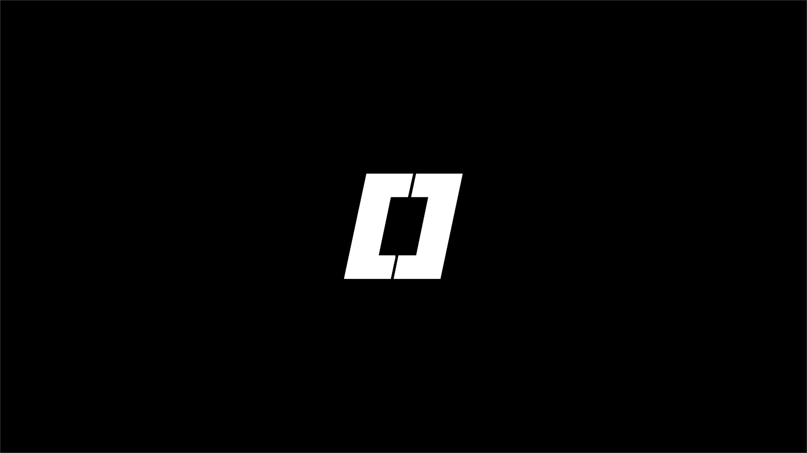

<div align="center">

# B0x Token DeFi dApp



**A fully decentralized DeFi front-end for B Zero X (B0x) Token**

[](LICENSE)
[](https://ethereum.org)
[](https://base.org)

[Live Site using this Github](https://b0x-token.github.io/B0x-Website/) | [IPFS Version](https://bafybeigl2dypumvljxyid5fig6zhi66nypgulppikmovx6wmqa5nt3vcna.ipfs.inbrowser.link/)

</div>

---

## Features

- **Token Swaps** - Seamlessly swap tokens on Ethereum and Base networks
- **Uniswap V4 Positions** - Create and manage B0x liquidity positions
- **Staking** - Stake your Uniswap V4 positions to earn rewards alongside B0x miners
- **Guess** - Play a Guess Game and win/lose B0x or become the house
- **Multi-Chain Support** - Works on both Ethereum Mainnet and Base
- **IPFS Compatible** - Fully decentralized hosting support with content verification

---

## Quick Start

### Prerequisites

- A modern web browser
- A Web3 wallet (MetaMask, etc.)
- **Windows**: [Python](https://www.python.org/downloads/) must be installed (used to run the local server)
- **Ubuntu / Linux**: [`http-server`](https://www.npmjs.com/package/http-server) must be installed (used to run the local server) — install with `npm install -g http-server`

### Run Locally

#### Windows

Double-click **`run_Windows_B0x_dAPP_offline.bat`** — it starts a local Python server on port 8000 and opens the site in your browser. Requires Python to be installed (see Prerequisites).

Alternatively, run it manually:

```bash
# 1. Install Python if not already installed
# 2. Open Command Prompt and navigate to the project folder
cd path/to/B0x-Website

# 3. Start a local server
python -m http.server 8000

# 4. Open http://localhost:8000 in your browser
```

#### Ubuntu / Linux
 
Step 1A) Allow Run_Ubuntu_B0x_dAPP_offline.sh to execute code or execute file as program of file
Step 1B) Allow z_runTheHTTP_Server.sh to execute code or execute as file in properties of file
Step 2) Double-click (or run) **`Run_Ubuntu_B0x_dAPP_offline.sh`** — it starts `http-server` in a new terminal and opens the site in Chrome. Requires `http-server` to be installed (see Prerequisites).

Alternatively, run a server manually:

```bash
# Option 1: Using Node.js http-server
npm install -g http-server
http-server

# Option 2: Using Python
python3 -m http.server 8000

# Option 3: Using PHP
php -S localhost:8000
```

Then visit `http://localhost:8000` (or `http://127.0.0.1:8080` if using `http-server`) in your browser.

---

## Architecture

```
B0x-Website/
├── index.html          # Main application entry
├── style.css           # Styling
├── js/                 # JavaScript modules
│   └── vendor/         # Third-party libraries (ethers.js, Chart.js, JSZip)
└── images/             # Assets and logos
```

---

## Data Sources

| Source | URL |
|--------|-----|
| Mainnet Data | https://data.bzerox.org/mainnet/ |
| GitHub Data | https://data.github.bzerox.org/ |

## RPC Endpoints

| Network | RPC URL |
|---------|---------|
| Ethereum | https://eth.llamarpc.com |
| Base (Primary) | https://mainnet.base.org |
| Base (Fallback) | https://gateway.tenderly.co/public/base |

---

## Assets

The `B[]x`, `B ZERO X`, and `B[]x DeFi` logo/banner images in `images/` were generated using **Mega Punch** by Hawtpixel (Darrell Flood) — https://www.dafont.com/megapunch.font. The font itself is not included or embedded in this site (no `@font-face`/webfont); it was only used locally to render the static PNG banners. If the banners ever need to be regenerated or extended, re-download the font from the link above.

---

## Contributing

Contributions are welcome! Feel free to:

1. Fork the repository
2. Create a feature branch (`git checkout -b feature/amazing-feature`)
3. Commit your changes (`git commit -m 'Add amazing feature'`)
4. Push to the branch (`git push origin feature/amazing-feature`)
5. Open a Pull Request

---

## Security

This dApp runs entirely client-side. Your private keys never leave your browser. Always verify you're on the correct URL before connecting your wallet.

---

## License

This project is open source and available under the [MIT License](LICENSE).

---

<div align="center">

**Built for the B0x Community**

</div>

